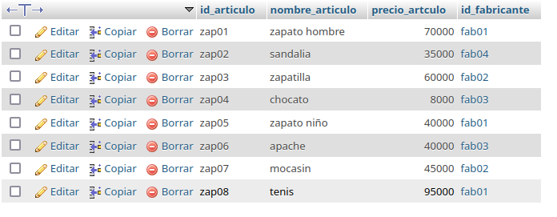

# bd_zapateria base de datos para una zapateria

## Modelo Entidad-Relacion

## Modelo Fisico de la BD

## tabla fabricante

## tabla articulo

## consultas a la bd

1. Mostrar la lista de todos datos de los fabricantes

`SELECT * FROM fabricante;`

2. Mostrar la lista de nombres de los fabricantes 

`SELECT nombre_fabricante AS fabricante FROM fabricante;`

3. Mostrar los nombres de los productos.

`SELECT nombre_articulo FROM * articulo`

4. mostrar los precios de los nombres de los productos

`SELECT nombre_articulo AS Nombre, precio_articulo AS Precio FROM Articulo;`

